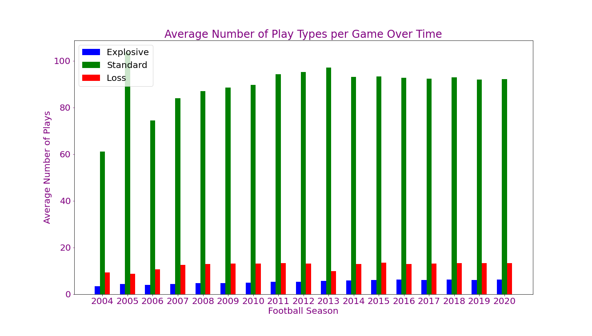

# College Football: The Decline of Defense
### Is college football defense going the way of the dinosaur?
### Team TigerGatorNole: Karina Hutula, Michelle Davis, Darryl Connelly

## Table of Contents
1. [Introduction](#introduction)
2. [Research Questions to Answer](#objectives)
3. [Hypothesis](#hypothesis)
4. [Dataset Used](#dataset)
5. [Limitations](#limitations)
6. [Technologies](#technologies)
7. [Files](#files)
8. [Analysis](#analysis)
9. [Implications and Future Steps](#implications)

### Introduction
The NCAA is interested in how college football games are changing over time to determine if changes are needed to increase its popularity. The NCAA wants to start by determining the direction of defense in college football and its effect on the game. We have been contracted to analyze the last 17 years of college football data to determine if the value of defense is diminishing.

### Research Questions to Answer
* Have average points per game increased over time?
* Have the number of turnovers per game decreased over time?
* Have the total yards per game increased over time?
* Has 3rd down efficiency per game increased over time?
* Has the margin of victory changed over time?
* Are there more explosive plays?
* Are there less punts per game?

### Hypothesis
Defensive value may be decreasing as the years progress and may be less important to the success of a team.

### Dataset Used
[College Football Data API](https://api.collegefootballdata.com)

### Limitations
* Prior to 2004, some statistics are not available in this API.
* We did not account for points scored by offense versus defense.
* The dataset does not include bowl games and playoff games.

### Technologies
This project uses: 
* Python Version 3.6.13
* Jupyter Notebook Version 6.1.4
* College Football Data API Key: stored in a variable named api_key in a file named config.py in the directory

### Files
* [Project_Proposal.docx](Project_Proposal.docx): word document containing the project proposal
* [api_calls.ipynb](api_calls.ipynb): Jupyter Notebook file that performs all API pulls and exports data to csvs
* [data_plots.ipynb](data_plots.ipynb): Jupyter Notebook file reads csvs and performs basic data analysis including plots and linear regressions
* [ttest_analysis.ipynb](ttest_analysis.ipynb): Jupyter Notebook file that performs ttesting on average points per game
* [avg_points_by_season.csv](Output/avg_points_by_season.csv): output of average points scored per game by season for 1970 to 2020
* [metrics_by_season.csv](Output/metrics_by_season.csv): output of all calculated metrics by season for 2004 to 2020
* [teams_points_against.csv](Output/teams_points_against.csv): output of all calculated metrics by season
* [2004_ttest_data.csv](Output/2004_ttest_data.csv): output of all datapoints for 2004 total points scored for ttest to be completed
* [2020_ttest_data.csv](Output/2020_ttest_data.csv): output of all datapoints for 2020 total points scored for ttest to be completed

### Analysis

### Implications and Future Steps
