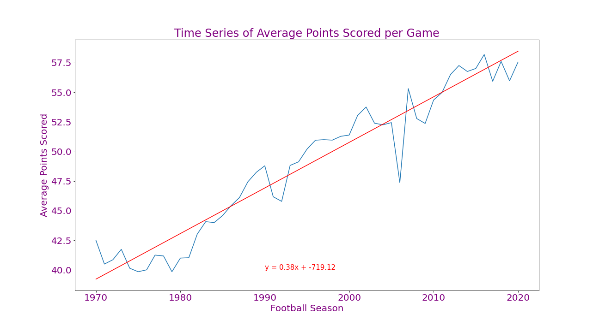
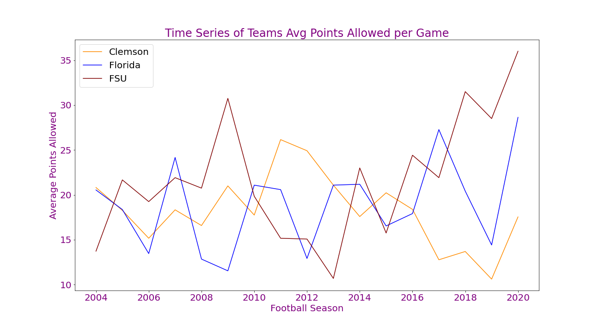

# College Football: The Decline of Defense
### Is college football defense going the way of the dinosaur?
### Team TigerGatorNole: Karina Hutula, Michelle Davis, Darryl Connelly

## Table of Contents
1. [Introduction](#introduction)
2. [Research Questions to Answer](#objectives)
3. [Hypothesis](#hypothesis)
4. [Dataset Used](#dataset)
5. [Limitations](#limitations)
6. [Technologies](#technologies)
7. [Files](#files)
8. [Analysis](#analysis)
9. [Implications and Recommendations](#implications)

### Introduction
The NCAA is interested in how college football games are changing over time to determine if changes are needed to increase its popularity. The NCAA wants to start by determining the direction of defense in college football and its effect on the game. We have been contracted to analyze the last 17 years of college football data to determine if the value of defense is diminishing.

### Research Questions to Answer
* Have average points per game increased over time?
* Have the number of turnovers per game decreased over time?
* Have the total yards per game increased over time?
* Has 3rd down efficiency per game increased over time?
* Are there more explosive plays?
* Are there less punts per game?

### Hypothesis
Defensive value may be decreasing as the years progress and may be less important to the success of a team.

### Dataset Used
[College Football Data API](https://api.collegefootballdata.com)

### Limitations
* Prior to 2004, some statistics are not available in this API.
* We did not account for points scored by offense versus defense.
* The dataset does not include bowl games and playoff games.
* Rule changes are not accounted for.
* Data is not analyzed by teams and/or conferences.

### Technologies
This project uses: 
* Python Version 3.6.13
* Jupyter Notebook Version 6.1.4
* College Football Data API Key: stored in a variable named api_key in a file named config.py in the directory

### Files
* [Project_Proposal.docx](Project_Proposal.docx): word document containing the project proposal
* [api_calls.ipynb](api_calls.ipynb): Jupyter Notebook file that performs all API pulls and exports data to csvs
* [data_plots.ipynb](data_plots.ipynb): Jupyter Notebook file reads csvs and performs basic data analysis including plots and linear regressions
* [ttest_analysis.ipynb](ttest_analysis.ipynb): Jupyter Notebook file that performs ttesting on average points per game
* [avg_points_by_season.csv](Output/avg_points_by_season.csv): output of average points scored per game by season for 1970 to 2020
* [metrics_by_season.csv](Output/metrics_by_season.csv): output of all calculated metrics by season for 2004 to 2020
* [teams_points_against.csv](Output/teams_points_against.csv): output of all calculated metrics by season
* [2004_ttest_data.csv](Output/2004_ttest_data.csv): output of all datapoints for 2004 total points scored for ttest to be completed
* [2020_ttest_data.csv](Output/2020_ttest_data.csv): output of all datapoints for 2020 total points scored for ttest to be completed

### Analysis

We wanted to start by looking at the big picture. We began by looking at the average points scored per game by season starting in 1970 to look at scoring trends. The reasoning for starting at this timepoint is because some sources consider 1970 to be the beginning of the modern age of college football. As seen on the chart, the scoring trend has seen significant growth over the years with a correlation statistic of 0.96.  With this in mind, does this mean that defensive statistics are trending down?  Well let’s see… 

Based on the NCAA request, a more recent time period would be better suited for our research, so we zoomed in from the previous graph to 2004 through present. From here, we wanted to show all data points from the same time range for consistency.  The new zoomed in graph shows a similar trend as before, but with a slightly lowered correlation statistic of 0.77.

Next, we were to perform a two sample t-test to prove a difference in means between the total points scored per game in 2004 and 2020. As can be seen by the histogram, our datasets are normally distributed, thus fulfilling a requirement for the t-test. Upon calculation, we got a p-value that was extremely low and close to zero, which allows us to reject the null hypothesis that the means of points scored are the same.  Thus proving the point  that scoring in 2020 is higher than in 2004, supporting the previous charts shown.

As we looked into the total yards per game over the years, we also saw the numbers trending up with a strong correlation of 0.76 which is similar with total points per game. This metric is a relevant indicator of how well the offense did, so as  a defense, you would want to limit the total yards the offense is able to accumulate. From the data, this again supports our hypothesis.

In American football, a turnover happens when the defense takes the ball away from the offense. That is attributed to fumbles, interceptions, and turnovers on downs by way of failed 4th down conversions. The number of turnovers is a positive defensive statistic.  We can see the trend of turnovers are decreasing over time and dropping significantly. The correlation shows that this is the strongest evidence so far, with a correlation statistic of -0.98.

As a defense, 3rd down  is the money down; you must get the offense off the field. That is, the defense must not allow the offense to convert the 3rd down to a new set of downs by reaching the 1st down line. It’s often the most critical moment for the defense to get the ball back to their offense.  Depending on field position, the vast majority of failed 3rd down conversions result in a punt or field goal attempt. Even though the correlation is moderate at 0.57, it still contributes to supporting our hypothesis. 

We decided to look at punts as opposed to field goals because punts are generally attributed to field position without a time or points factor included. As with plays for loss, we believed we would see less punts over time because the offense would be scoring more often and being able to convert more 3rd downs. If so, this would be plus for the defense. This chart is showing that punts are trending upwards with a correlation of 0.64.  This trend is contrary to our hypothesis, but we believe this may be a result of more possessions by the offense or an increase game speed over the years.

Along with our thoughts on punts, we believed we would see less plays for loss over time because of the increase in offensive yards.  This chart, however, shows a moderately correlated (0.65), increasing trend over time.  Though this trend is contrary to our hypothesis, plays for loss could be a result of more possessions by the offense or an increase game speed, which leads to more plays overall.  Further analysis would be needed to investigate if the pace of play is changing and how it may be impacting the game.

Another way to qualify defensive value is by looking at the number of offensive explosive plays per game.  We defined an explosive play as a running play that goes for 20 or more yards and a passing play that goes for 30 or more yards.  Our expectation was that explosive plays would be increasing over the years, and we’ve been proven correct with a strong, positive correlation of 0.95.

To take it one step further, we wanted to see how standard plays have changed over time.  Standard plays are defined as anything not categorized as a loss or explosive.  We would have expected to see a relatively flat line here, but we are again seeing a moderate increase with a correlation statistic of 0.48.  Interestingly, all three play categories have increased over time. This is another piece of evidence to encourage future investigation into change of game pace.

From our previous data, we were able to conclude that the average defensive value has declined statistically over the years.  Even with our individual favorite teams, all being championship game winners within this time frame, we can see 2 of the 3 teams have declined defensively. Interestingly, all of the years with average points against falling below about 15 per game are high performing years for those teams, most often associating with a BCS or National Championship title as well as conference championship titles.  When we look at this data, we see that defense is still needed to be a championship contender even as the offensive stats are becoming increasingly over-powering.

### Implications and Recommendations
* Implications
    1. Assuming no changes are made to the game, we can continue to expect to see a rise in scoring as the seasons go on
    2. The apparent value of defensive players may be harmed by this trend, though a high caliber defense may still be important to having a high achieving team
* Recommendations
    1. Investigate if the trend of defense has had or will have a negative impact on the game, such as competitiveness or excitement of the game
    2. Investigate how the speed of gameplay has changed over time and its affects on offense and defense
    3. Investigate the relationship between strength of defense and team performance